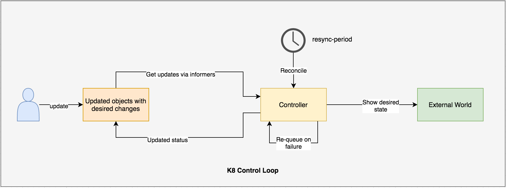

# Kubernetes Programming

- Developing Kubernetes native applications that can directly interacts with API server, get the current state of resource and update the same.
- Develop genuinely cloud native applications.

## Who develop such applications ?
- SRE, (Site Reliability Engineer): A person who operates an application by writing software.
- They know how to develop a software for a particular application domain.
- The resulting piece of software has application's operational domain knowledge programmed into it.

## What are these applications called ?
- These applications are called Operators.
- An Operator is an application specific controller, that extends Kubernetes api server to create,update,delete and list the complex application on behalf of Kubernetes user.
- These Operators have knowledge about application domain, and can automate operational tasks.

There are multiple ways to customize Kubernetes: use config files or flags at control plane components like kubelet or Kubernetes API server.

### Controllers
- A controller creates a control loop, that monitors the shared state of cluster through API server and make changes to update the current state into desired state.

### Operators
- These are also controllers that has some operational knowledge, such as application life cycle management. 

### Informers
- They perform periodic reconciliations and ensure that there should be no drift between current state and the desired state.

### Work Queue
- Queue the event changes.
- Handle retries.   

## Different ways of detecting change.
### Edge-Driven Triggers
- When the state change occurs, a handle is triggered. Eg. No pod to running pod.

### Level-Driven Triggers
- The state is checked in regular period of time. If any changes are detected the the handlers get triggered.
- Later is the form of polling.

## UseCase: Write a controller to GET the state of a pod.
### Input: Namespaces, PodName
### Output: Current state of pod

## System Requirements
- Go v1.14
- Dep [Dependency Management]
  - k8s.io/apimachinery@v0.17.9
  - k8s.io/client-go@v12.0.0
- Minikube v1.12.1
  - Execute `kubectl proxy --port=8080` to expose API server on port 8080.
  
  
      